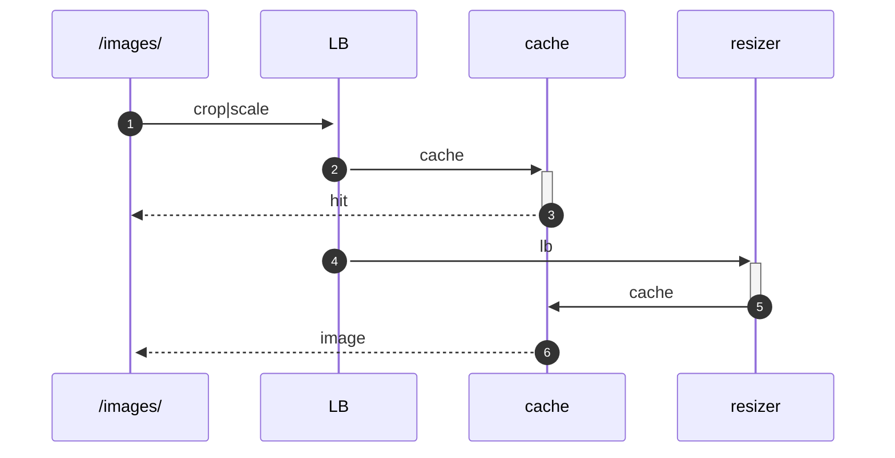

# Image Processing / CDN

## Endpoint

For the "core" application the endpoint is configured by environment variable `IMAGE_RESIZER_ENDPOINT`  
in Python and TypeScript context available via `settings.IMAGE_RESIZER_ENDPOINT`.

For *external* use the value can be retrieved via API settings endpoint:  
`/api/v1/base/settings/`

## Images

Images can be retrieved either "scaled" (`scale`) or "cropped" (`crop`) mode, in the needed "size" (`<w>x<h>`).

### Example

Assuming an image endpoint as:  

```
# IMAGE_RESIZER_ENDPOINT
https://next.openbroadcast.ch/images/
```

And an image resource in the form of:

```
curl https://next.openbroadcast.ch/api/v1/catalog/artists/D0BBF91A/ | jq '.image'
# 
"image": {
    "path": "catalog/artist/DFD5FE55/60748682.jpg",
    ...
},
```

Combine the two:

```
<IMAGE_RESIZER_ENDPOINT><mode>/<width>x<height>/<path>
```

```
# example
https://next.openbroadcast.ch/images/crop/200x200/catalog/artist/DFD5FE55/60748682.jpg
```


## Image (Re-)Sizer Implementation & Flow

The resizer is implemented in Go and runs as cloud function on GCP.  
- Source: [functions/http-image-resizer](../../functions/http-image-resizer/)

